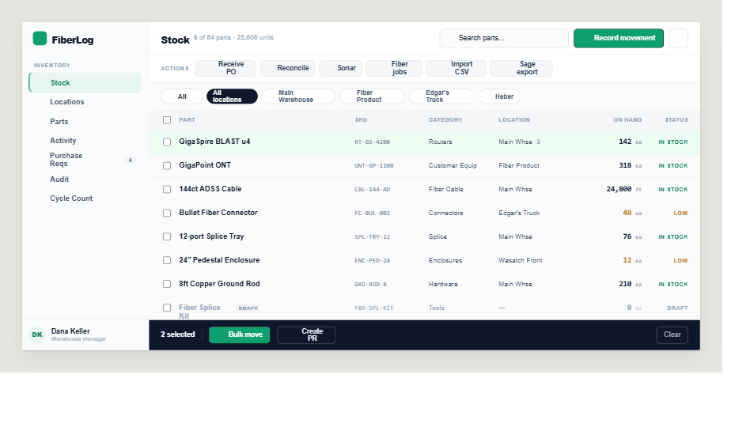
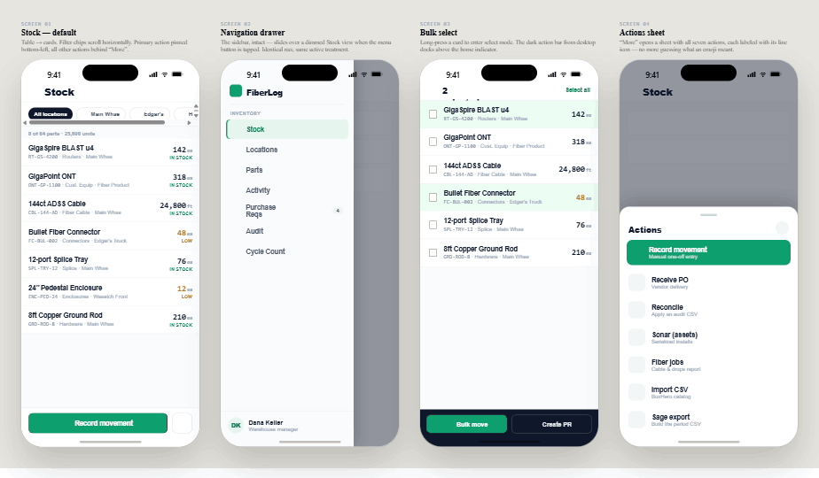

# Handoff: FiberLog "Console" Redesign

## Overview

FiberLog is a field-logging + inventory app for Utah Broadband (FIF Utah LLC), used daily by ~20 fiber/infra crews and managers. The current UI is a **dark-default** surface that mixes emoji glyphs, and rows that blend navigation with actions. This handoff covers a redesign — codenamed **Console** — that:

- Moves to a **light-default** surface (calm slate neutrals + emerald accent).
- Replaces **every emoji** with one consistent line-icon set (~30 icons).
- **Separates navigation from actions** — sub-tabs live in a left sidebar (a drawer on phone); the "do something" actions live in a toolbar / "More" sheet.
- Is **genuinely responsive** — each view defines a desktop table layout AND a phone card layout from the same data, rather than one layout that degrades.

Three directions were explored (Atlas / Console / Field). **Console is the chosen direction** — proceed with it. The other two are included only for context (see the Directions mockup).

### Quick look



*Desktop Stock (flagship): left sidebar nav · toolbar with primary action · secondary action strip · filter chips · data table with select / low / draft states · dark bulk-select bar.*



*Phone: Stock (table → cards, pinned action bar) · navigation drawer · bulk-select mode · actions sheet.*

> Screenshots are rendered from the mockups in `mockups/`. Fonts may differ slightly in these captures; the live mockup files are the source of truth.

The redesign was scoped + estimated against the **Inventory tab first** (the test bed), then a full-app rollout plan was produced. Both are documented below.

---

## About the design files

The files in `mockups/` are **design references created in HTML** — prototypes showing intended look and behavior. **They are not production code to copy directly.**

The target codebase already exists: it's the **`fiberlog-react`** project (React 18 + Vite + plain JSX, no TypeScript; Supabase backend; inline styles + CSS variables in `src/styles/global.css`; no Tailwind, no CSS modules). The task is to **recreate these Console designs inside that codebase, reusing its existing structure, data layer, and conventions** — not to introduce the mockup's tooling.

Concretely:
- The mockups are authored as `.dc.html` "Design Component" files and rely on a runtime (`support.js`) + an iOS device frame (`ios-frame.jsx`) **purely to render the preview**. Ignore both at implementation time — they are scaffolding, not part of the design.
- Icons in the mockups are inline `<svg><symbol>` definitions. Port them to the codebase's icon approach (a shared `Icon` component or inline SVGs), keeping the same glyphs.
- All styling in the mockups is inline — which happens to match the codebase's own inline-style + CSS-variable convention. Re-point the existing token layer rather than hardcoding hex everywhere (see **Design Tokens**).

**How to view the mockups:** open any file in `mockups/` in a browser (they're self-contained except for Google Fonts loaded via CDN). `Inventory Redesign Directions.dc.html` and `Console - Mobile.dc.html` are the visual specs; `Console Rollout Tracker.dc.html` is an interactive plan; `Console Redesign - Plan.dc.html` is the effort writeup.

---

## Fidelity

**High-fidelity.** Final colors, typography, spacing, icons, and states are specified. Recreate the Console UI to match — pixel-level intent — using the codebase's existing libraries and patterns. Where the mockup and the existing codebase conflict on a value, the **mockup wins for visual treatment**; the **codebase wins for data, logic, and component structure**.

> One important caveat: the mockups show **8 representative stock rows and a handful of locations** as sample data. Real data comes from Supabase (64+ part types, ~25k units, multiple warehouses/bins/trucks/projects). Wire every screen to the existing data helpers — don't hardcode the sample rows.

---

## Design system (Console direction)

### Color tokens

The redesign flips the app from dark-default to **light-default**. Re-point the existing `:root` tokens in `src/styles/global.css` (and the `[data-theme]` overrides). The existing token *names* (`--bg`, `--surface`, `--text`, `--teal`, etc.) are reused throughout the codebase, so changing their values cascades — that is the intended low-risk path. Map as follows:

| Role | Token (existing name to re-point) | Console value | Notes |
|---|---|---|---|
| App background | `--bg` | `#FBFBFC` | near-white, very slightly cool |
| Surface (cards, bars) | `--surface` | `#FFFFFF` | |
| Surface 2 (sidebar, table header) | `--surface2` | `#FAFBFC` / `#F4F6F8` | sidebar `#FAFBFC`; table header row `#F4F6F8` |
| Border | `--border` | `#E8EBEF` | hairlines between sections |
| Border 2 (inputs) | `--border2` | `#DDE2E8` | input + button outlines |
| Row divider | — | `#EEF1F5` | between table rows |
| Text (primary) | `--text` | `#0F172A` | slate-900 |
| Muted text | `--muted` | `#475569` | slate-600, secondary cell text |
| Hint text | `--hint` | `#94A3B8` | slate-400, labels, SKUs, counts |
| **Accent (primary)** | `--teal` (re-point) or new `--accent` | `#0E9F6E` | emerald — primary button, active nav, links |
| Accent pressed/border | `--teal-dk` | `#0A7A54` | active-nav text, darker emerald |
| Accent tint (bg) | `--teal-lt` | `#E7F6EF` | active nav pill bg; `#ECFDF3` for selected table rows |
| Warning / Low stock | `--amber` | `#B7791F` | "LOW" status text + number |
| Warning dot | — | `#C2841C` | low-stock status dot |
| Draft / disabled | `--hint` | `#94A3B8` | draft rows greyed; dot `#C0BDB3` |
| In-stock dot/text | `--teal-dk` | `#0A7A54` (text), `#1F9D63` (dot) | |
| Dark bar (selection / "next up") | — | `#0F172A` | bulk-select action bar, dark callouts; bright accent on it = `#5EEAB0` |

Status semantics: **In stock** = emerald, **Low** = amber, **Draft** = grey.

### Typography

- **Primary family:** `Public Sans` (weights 400/500/600/700/800). System-ui fallback.
- **Monospace:** `IBM Plex Mono` (weights 400/500/600) — used for **SKUs, numeric quantities ("on hand"), counts, uppercase labels, and stat figures**. This mono-for-data treatment is a signature of the Console look — keep it.
- Both load from Google Fonts in the mockups; in the app, add them the same way the existing fonts are loaded.

Type scale observed in the mockups (desktop):

| Use | Size | Weight | Notes |
|---|---|---|---|
| Page title (toolbar "Stock") | 17px | 800 | letter-spacing -0.01em |
| Section/page H1 (body) | 22px | 800 | |
| Table cell — part name | 13.5px | 600 | |
| Table cell — secondary | 12.5px | — | color `#475569` |
| Table quantity (mono) | 14px | 600 | IBM Plex Mono |
| SKU (mono) | 12px | — | IBM Plex Mono, `#64748B` |
| Column header | 10.5px | 700 | uppercase, letter-spacing 0.05em, `#94A3B8` |
| Status text | 11px | 700 | uppercase, letter-spacing 0.03em |
| Nav item | 13.5px | 600 (700 active) | |
| Section label (sidebar/uppercase) | 10.5px | 700 | uppercase, letter-spacing 0.08em |
| Sub-line / meta | 12px–12.5px | 500 | `#94A3B8` |

Phone sizes scale up slightly: card part-name 15px/700, mono quantity 18px/600, nav items 15px.

### Spacing, radius, shadow

- **Radius:** buttons/inputs `8px`; cards/containers `12px`; pills `999px`; phone buttons `10–11px`; bottom sheet `22px` top corners. (Card outer container in some frames uses `3px` — that's the mockup's "paper" frame, *not* part of the product UI; product cards are `12px`.)
- **Icon button:** 36×36 desktop (8px radius), 46×46 phone (11px radius).
- **Control heights:** primary/secondary buttons 36px desktop; search input 36px; filter pills 28px; toolbar 60px; sidebar/top bars 60px. Phone: primary button 46px, filter chips 30px, cards ~54px tall.
- **Shadows:** kept very light. Cards: `0 1px 3px rgba(0,0,0,.10)`. Drawer/sheet overlays: `0 0 40px rgba(0,0,0,.25)` / `0 -10px 40px rgba(0,0,0,.2)`. Scrim: `rgba(15,23,42,0.45)`.

### Icon set (~30 line icons)

One consistent stroked line-icon family replaces all emoji. Stroke width ~1.6–1.8, round caps/joins, 24×24 viewBox. The full set is defined as `<symbol>` blocks at the top of each mockup — copy the path data. Mapping of icon → meaning:

| Icon id | Meaning / where used |
|---|---|
| `box` | Stock / brand mark |
| `warehouse` | Locations / warehouse filter |
| `nut` | Parts catalog |
| `activity` | Activity (movement history) |
| `clipboard` | Purchase Requests / Create PR |
| `scan` | Audit |
| `grid` | Cycle Count |
| `truck` | Truck location filter |
| `pin` | Project/region location filter |
| `search` | Search inputs |
| `plus` | Record movement (primary action) |
| `download` | Receive PO |
| `refresh` | Reconcile |
| `zap` | Sonar import |
| `layers` | Fiber jobs |
| `upload` | Import CSV |
| `receipt` | Sage export |
| `move` | Bulk move |
| `filter` | Filter dropdown |
| `dots` | "More" / overflow menu |
| `chevron-down` / `chevron-right` | Disclosure / drill-in |
| `menu` / `x` | Drawer open / close (phone) |
| `tag`, `sliders`, `layout`, `sparkle`, `folder`, `chart`, `gear`, `rotate`, `arrow`, `check` | used in plan/tracker + secondary surfaces |

---

## Screens / Views

### Inventory · Stock (flagship) — desktop

The reference frame is **Direction 02 (Console)** in `Inventory Redesign Directions.dc.html`. This is the template all other inventory views inherit.

**Layout:** two-column. Fixed **left sidebar (236px)** + fluid **main column**.

**Sidebar (236px, bg `#FAFBFC`, right border `#E8EBEF`):**
- Top (60px, bottom border): emerald 26×26 rounded-7px brand chip with `box` icon + "FiberLog" wordmark (17px/800, letter-spacing -0.03em).
- Nav group: an uppercase "Inventory" section label, then 7 nav items: **Stock, Locations, Parts, Activity, Purchase Reqs, Audit, Cycle Count.** Each is icon (18px) + label (13.5px/600), 9px×11px padding, 8px radius.
  - **Active item** (`Stock`): bg `#E7F6EF`, text `#0A7A54`, weight 700, and an inset 2px left accent bar (`inset 2px 0 0 #0E9F6E`).
  - **Purchase Reqs** carries a count badge (pill `#EEF1F5` bg, `#64748B` text) — e.g. "4".
- Footer (top border): 32px circular avatar (`#E7F6EF`/`#0A7A54` initials) + name (13px/700) + role (11px/`#94A3B8`).

**Main column (bg `#FBFBFC`), top to bottom:**
1. **Toolbar (60px, white, bottom border):** page title "Stock" (17px/800) + meta "8 of 64 parts · 25,606 units" (12.5px/`#94A3B8`). Right-aligned: search input (240px, 36px, `search` icon prefix), emerald **Record movement** primary button (`plus` icon), and a 36×36 `dots` overflow icon-button.
2. **Secondary action strip (white, bottom border):** an uppercase "ACTIONS" label then a row of light chip-buttons (`#F4F6F8` bg, `#E3E8EE` border, 30px, 7px radius): **Receive PO, Reconcile, Sonar, Fiber jobs, Import CSV, Sage export.** Each icon + label, 12.5px/600. *This strip is the realization of "navigation ≠ actions" — these are the operations that used to be mixed into the tab row.*
3. **Filter row (bg `#FBFBFC`, bottom border):** a `filter`/"All" dropdown pill, then location filter chips. The **active chip is dark** (`#0F172A` bg, white text); inactive chips are white with `#DDE2E8` border, icon + label (12px/600). Chips seen: All locations · Main Warehouse · Fiber Product · Edgar's Truck · Heber. Icons differentiate type (`warehouse` / `truck` / `pin`).
4. **Data table:**
   - **Column grid:** `34px 1fr 138px 130px 150px 116px 86px` → checkbox · Part · SKU · Category · Location · On hand · Status.
   - **Header row** (38px, `#F4F6F8` bg): 10.5px/700 uppercase labels, `#94A3B8`. Includes a select-all checkbox (accent `#0E9F6E`).
   - **Body rows** (44px, divider `#EEF1F5`): Part name 13.5px/600; SKU mono 12px `#64748B`; Category + Location 12.5px `#475569`; **On hand** right-aligned mono 14px/600 with a small `ea`/`ft` unit suffix in `#94A3B8`; **Status** right-aligned, 11px/700 uppercase (IN STOCK = `#0A7A54`, LOW = `#B7791F`, DRAFT = `#94A3B8`).
   - **Selected row:** bg `#ECFDF3`, checkbox checked.
   - **Low-stock row:** quantity + status render in amber `#B7791F`.
   - **Draft row:** entire row greyed to `#94A3B8`, a small "DRAFT" chip next to the name, checkbox disabled.
5. **Bulk-select action bar (docks at bottom of main column when ≥1 row selected):** dark `#0F172A` bar, white text. "N selected" + divider + emerald **Bulk move** button (`move` icon) + outlined **Create PR** button (`clipboard` icon) + right-aligned ghost **Clear**.

### Inventory · Stock — phone

Reference: `Console - Mobile.dc.html` (4 screens, rendered in an iOS frame). The device frame is preview-only — build responsive React, not a fixed 402px frame.

**Screen 01 — Stock (default):**
- Top bar (white): `menu` (hamburger, opens drawer) + "Stock" title (22px/800) + `search` icon.
- Horizontally-scrolling filter chips (same semantics as desktop; active chip dark).
- Meta line "8 of 64 parts · 25,606 units" (12px/`#94A3B8`).
- **Rows become cards:** each card = left block (part name 15px/700 + a single meta line "`SKU` · Category · Location" in 12px/`#94A3B8`, SKU in mono) and right block (mono quantity 18px/600 + unit + status text 10px/700). Low items in amber.
- **Pinned bottom bar (white, top border):** full-width emerald **Record movement** button (46px) + a 46×46 `dots` button that opens the Actions sheet. Respect the home-indicator safe area (extra bottom padding).

**Screen 02 — Navigation drawer:** the sidebar slides in from the left (300px) over a scrim (`rgba(15,23,42,0.45)`). Identical nav + active treatment to desktop; close `x` top-right of the drawer header; user chip pinned to drawer footer.

**Screen 03 — Bulk select:** long-press a card enters select mode. Top bar becomes `x` (exit) + "N selected" + "Select all". Selected cards get `#ECFDF3` bg + checked checkbox. The dark action bar (Bulk move / Create PR) docks above the home indicator.

**Screen 04 — Actions sheet:** the `dots`/"More" opens a bottom sheet (white, 22px top radius, grab handle, "Actions" title + close). First item is the emerald **Record movement** card (icon + title + subtitle). Below it, the 6 secondary actions as list rows: 38×38 `#F1F5F9` icon tile + title (15px/600) + subtitle (12px/`#94A3B8`) + `chevron-right`. Actions & subtitles:
  - Receive PO — "Vendor delivery" (`download`)
  - Reconcile — "Apply an audit CSV" (`refresh`)
  - Sonar (assets) — "Serialized installs" (`zap`)
  - Fiber jobs — "Cable & drops report" (`layers`)
  - Import CSV — "BoxHero catalog" (`upload`)
  - Sage export — "Build the period CSV" (`receipt`)

### Other inventory views (apply the same recipe)

The flagship Stock view establishes the pattern; these inherit it (table↔card, filter chips, sidebar nav, action strip):
- **Locations** — warehouse → bin tree (the heaviest; nested disclosure).
- **Parts** — catalog incl. drafts cleanup.
- **Activity** — movement history + filters.
- **Purchase Requests** — queue + status pills.
- **Audit** — CSV generator with scope + filters.
- **Cycle Count** — a full-screen, multi-step scanner flow (separate chrome from the rest of the tab).
- **~12 action/detail sheets** — Record movement, Receive PO, Reconcile, Sonar import, Fiber jobs, Import CSV, Sage export, Bulk move, PR composer, bin/SKU labels, etc. Build these on a shared sheet/drawer primitive.

### Plan & tracker (reference docs, not screens to build)
- `Console Redesign - Plan.dc.html` — the Inventory-tab build plan: 7 phases (Foundation → App shell → Stock → Read tabs ×5 → Cycle count → Sheets ×12 → Polish), **27–39 dev-days**, ~6–8 weeks for 1 dev. Foundation-first, ship behind a per-view flag.
- `Console Rollout Tracker.dc.html` — interactive tracker for taking Console across the **whole app** (Inventory, Submissions, Crew status, Projects, Reports, Assemblies, Admin, Crew app, Polish). Useful as the master backlog; its embedded task list + day estimates are a good source for sequencing the full rollout (~80–110 dev-days total). Click tasks to cycle status; state saves to localStorage.

---

## Interactions & behavior

- **Nav vs. actions:** sidebar items only navigate (swap the active view). Actions (toolbar primary, action strip, "More" sheet) only mutate/open sheets. Never mix the two affordances in one control.
- **Active nav state:** emerald tint bg + emerald text + 2px inset left bar.
- **Filter chips:** single active "location" filter at a time (active = dark chip). The "All / Filter" dropdown is a separate multi-criteria control.
- **Search:** filters the current view's rows client-side over name / SKU / category (matches existing behavior).
- **Bulk select:** desktop via row checkboxes; phone via long-press. Selecting ≥1 row reveals the dark action bar with Bulk move + Create PR; "Clear"/`x` exits select mode.
- **Drafts** (parts with `is_active=false`): greyed, "DRAFT" chip, not selectable, status reads DRAFT.
- **Low stock:** quantity + status styled amber. (Threshold logic stays as in the codebase.)
- **Responsive breakpoint:** the codebase has a shared `useIsWide.js` hook at **768px** — reuse it. Wide → sidebar + table; narrow → drawer + cards + bottom bar + sheets.
- **Back button:** the codebase has a `useBackClose` hook + back-stack coordinator (see its CLAUDE.md). Any new drawer/sheet/select-mode must register with it so Android/phone Back closes the layer instead of exiting the app.
- **Transitions:** keep light — drawer slide-in, sheet slide-up, progress-bar width transitions (~.3s ease). No heavy motion.

## State management

No new global state is required for the visual redesign. Reuse the existing app's state and data flow:
- Auth, current user, projects, users, realtime subscriptions live in `AppContext.jsx`.
- Inventory ops live in `lib/inventory.js`; general data helpers in `lib/supabase.js`. The mockups' sample rows map to `getStock*` / stock helpers there.
- Local component state for: active sub-view, active location filter, search query, selected-row set / select-mode, open sheet/drawer.
- Persisted prefs already use localStorage (`fiberlog_dark_mode`, `fiberlog_view_mode`, etc.) — follow that pattern for any new view preference.

> **Scope guardrail (from the plan):** this is **presentation only**. No schema, RPC, or business-logic changes. If a screen seems to need a data change, flag it rather than building it.

---

## Assets

- **Fonts:** Public Sans + IBM Plex Mono (Google Fonts). Load alongside existing app fonts.
- **Icons:** ~30 inline SVG line icons — path data lives in the `<symbol>` blocks at the top of each mockup file. No external icon library; port them into the codebase's icon convention.
- **Images:** none. No raster assets, no logos beyond the SVG `box` brand chip + wordmark.

---

## Files in this bundle

```
design_handoff_console_redesign/
  README.md                              ← this file
  mockups/
    Inventory Redesign Directions.dc.html  ← desktop Stock, 3 directions (build Direction 02 · Console)
    Console - Mobile.dc.html               ← phone: Stock, drawer, bulk-select, actions sheet
    Console Redesign - Plan.dc.html        ← Inventory-tab build plan + effort (27–39 dev-days)
    Console Rollout Tracker.dc.html        ← interactive full-app rollout backlog (~80–110 dev-days)
    support.js                             ← preview runtime ONLY (ignore at build time)
    ios-frame.jsx                          ← preview device frame ONLY (ignore at build time)
  screenshots/
    console-desktop-stock.png              ← desktop Stock flagship
    console-phone-screens.png              ← 4 phone screens
```

### Source files in the target codebase to recreate against

Open these in the `fiberlog-react` project — they are the current (pre-redesign) implementations the Console design replaces. Its own `CLAUDE.md` is the authoritative codebase guide (stack, schema, conventions, back-stack hook, sheet pattern).

- `src/styles/global.css` — token layer to re-point (light default, emerald accent).
- `src/components/manager/InventoryView.jsx` — the inventory section shell (5 sub-tabs + action sheet buttons). **Primary target for the App shell + action-strip work.**
- `src/components/manager/InventoryStockTab.jsx` — **the flagship Stock view.**
- `src/components/manager/InventoryLocationsTab.jsx`, `InventoryPartsTab.jsx`, `InventoryMovementsTab.jsx` (Activity), `InventoryAuditTab.jsx`, `PurchaseRequestsTab.jsx` — the other sub-tabs.
- `src/components/cycleCount/CountTab.jsx` (+ `cycleCount/*` sheets) — the cycle-count scanner flow.
- `src/components/manager/RecordMovementSheet.jsx`, `ReceivePOSheet.jsx`, `ReconcileSheet.jsx`, `SonarImportSheet.jsx`, `SageExportSheet.jsx`, `BulkMoveSheet.jsx`, etc. — the ~12 action/detail sheets.
- `src/components/manager/ManagerApp.jsx` — top-level nav (where the sidebar/drawer pattern generalizes for the full rollout).
- `src/lib/useIsWide.js` — 768px breakpoint hook (drives table↔card).
- `src/lib/inventory.js`, `src/lib/supabase.js` — data helpers to wire screens to.

---

## Recommended sequence (from the plan)

1. **Foundation** — re-point tokens (light + emerald), port the ~30 icons, build shared primitives (button, badge/pill, card, table↔card list, sheet, drawer, sidebar, filter bar, empty/loading states).
2. **App shell** — sidebar + responsive drawer, toolbar, "More" actions sheet, page frame (in `InventoryView` first).
3. **Stock (flagship)** — table + card layouts, location/bin filters, search, bulk-select + selection bar. Nail it once.
4. **Read tabs ×5** — Locations (tree is the heavy one), Parts, Activity, PRs, Audit — inherit the Stock recipe.
5. **Cycle count** — full-screen scanner flow.
6. **Action & detail sheets ×12** — on the shared sheet primitive.
7. **Polish & QA** — responsive sweep, empty/loading/error states, accessibility, dark-mode decision (recommend light-first, dark as fast-follow).

Ship behind a per-view flag so the redesign runs next to the current UI without a big-bang cutover. After Inventory proves out, use the **Rollout Tracker** as the backlog for the rest of the app.
